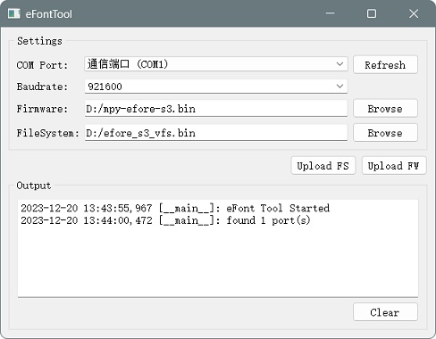
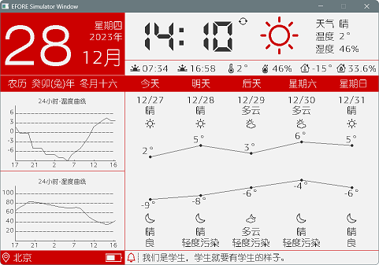
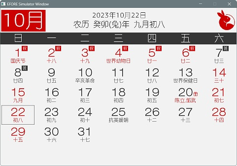
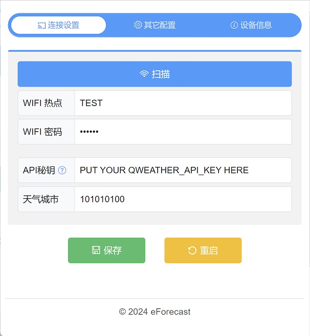
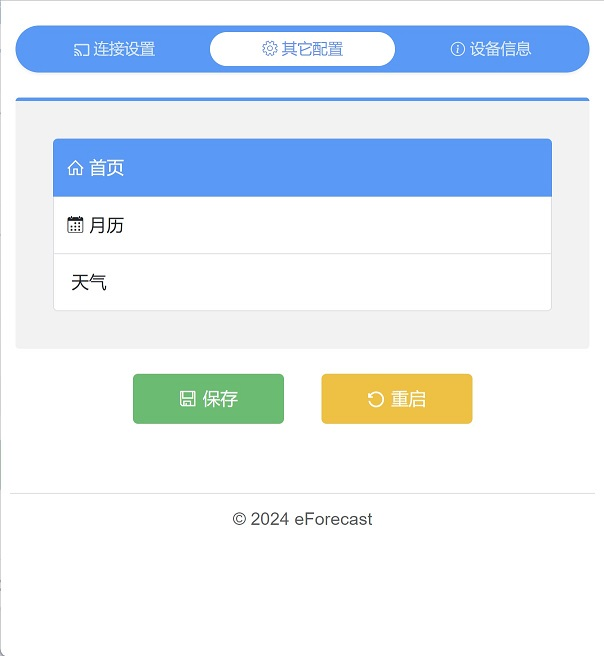
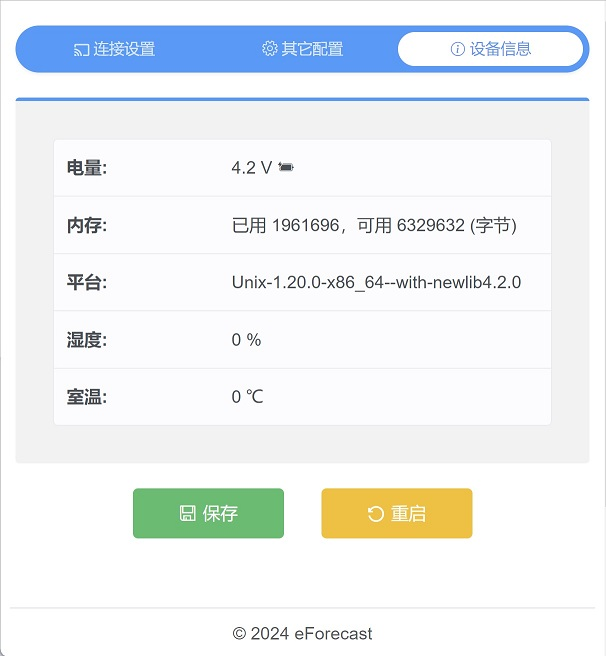

# EFont Demo

## 目录

- [EFont Demo](#efont-demo)
  - [目录](#目录)
  - [关于此工程](#关于此工程)
  - [快速使用](#快速使用)
  - [VSCode 中编辑代码](#vscode-中编辑代码)
  - [附加说明](#附加说明)
    - [1. 国家重大节日放假安排\[休/班\]](#1-国家重大节日放假安排休班)
    - [2. 家人生日显示](#2-家人生日显示)
    - [3. 本工程的图标资源](#3-本工程的图标资源)
  - [页面展示](#页面展示)
    - [天气](#天气)
    - [日历](#日历)
  - [天气数据源](#天气数据源)
  - [WEB 配置](#WEB配置)
  - [参考](#参考)
  

## 关于此工程
此工程包含的是 EPD_mpy_efont 的几个有用的实例（目前不断完善中）。可以在 micropython 的模拟器以及 ESP32-S3 的硬件上测试使用。

推荐在 VSCode 中打开本工程目录。同时，需要安装一下 python3 环境，工具脚本、代码提示之类的需要。如果只看脚本运行效果，或者简单改改 py 的文本、布局，不用 python 环境亦可。

[参考](#参考) 中给出了此工程所参考的相关资源。

## 快速使用
在 tools/win-cygwin 中提供了一个 micropython.exe 供 Windows 用户在 Windows 平台上快速预览 Demo。对于 unix，可以直接编译 [EPD_mpy_efont](https://github.com/dotnfc/EPD_mpy_efont/blob/main/docs/build_CN.md) 的 Unix Port。

比如修改了 10.2 寸三色屏的 Demo，开一个控制台 CTRL+` 在命令行中执行如下命令即可立即预览修改结果: 
> tools\win-cygwin\efore-demo.cmd

如需放到 ESP32-S3 开发板上去运行，那就可以
- 使用 [thonny](https://thonny.org/)
- 将 code 打包为 vfs，然后使用工具下载到目标板上
  
> 打包 vfs，可以[参考这个方法](https://github.com/dotnfc/EPD_mpy_efont/blob/main/README_CN.md#4-%E6%96%87%E4%BB%B6%E7%B3%BB%E7%BB%9F)。下载的方法比较多，这里有一个 mpy_efont_tool (位于 .\tools\esp32_tool\mpy_efont_tool.py)，运行时需要脱离 mpy stubs 的 venv，并在 python 中安装其依赖包:

> EPD_mpy_efont_demo\tools\esp32_tool> pip install -r requirements txt 



## VSCode 中编辑代码
首先需要安装 python 相关扩展，以及 'MicroPython stubs'，并建立 venv，请参考 [Using the MicroPython stubs](https://micropython-stubs.readthedocs.io/en/main/20_using.html), 以支持代码智能提示。

仓库中已经携带了 mpy stubs 的配置，见 .vscode/settings.json

对于 efont 的特定 stub，存放于 .efont 目录中。

## 附加说明
### 1. 国家重大节日放假安排[休/班]
一般国务院假日办会在 11 月份左右公布次年安排。

拿到这个安排后，手动编写 tools/util_genArrangementHolidays.py 年份函数去生成次年的数据，然后贴到 lib/holidays.py 的 nation_arrangements 变量中即可。

### 2. 家人生日显示
我们一般按农历过生日，可以把大家的姓名和农历生日放到 excel 表格中的两列，然后复制到 tools/util_lunar2MonDay.py 的 
days 变量中，注意分隔符是制表符 '\t'。

这个脚本就会生成程序所需的数据，粘贴到 lib/birthdays.py 的 familyBirthdays 变量即可。

### 3. 本工程的图标资源
字体、图标资源一般使用 font 目录下的。对于天气图标，使用的是 qweather-icons.ttf 基于[和风天气图标](https://github.com/qwd/Icons)，新增而来。如需查看完整列表，请打开 

> tools/qweather-icons/qweather-icons-demo.html

## 页面展示
### 天气


### 日历


注意：

    按键 A - 模拟 用户按键，可做左翻（月份 -1）
    按键 D - 模拟 IO0，可做右翻（月份 +1）

## 天气数据源
代码中采用了[和风天气开发服务](https://dev.qweather.com/docs/)，使用的时候，需要注册得到一个 api key，请放到 settings.py 中。

另外，为减少开发阶段的数据请求，我们可以把需要的数据通过浏览器获取到以后，放到 qweather_test.py 中。

比如：
```html
7天天气预报
   https://devapi.qweather.com/v7/weather/7d?location=101010100&key=APIKEY
实时天气
   https://devapi.qweather.com/v7/weather/now?location=101010100&key=APIKEY
逐小时天气预报 
   https://devapi.qweather.com/v7/weather/24h?location=101010100&key=APIKEY
空气质量5天预报
   https://devapi.qweather.com/v7/air/5d?location=101010100&key=APIKEY
以及一言地址
   https://v1.hitokoto.cn/?encode=json&min_length=1&max_length=21
```

## WEB配置
使用热点网络配置设备的相关信息，比如 要连接的热点，天气 API_KEY，城市；首页信息等。先上图：

### 连接配置


### 启动页配置


### 设备信息



## 参考

 - [weather-icons](https://erikflowers.github.io/weather-icons/)
 - [esp32-weather-epd](https://github.com/lmarzen/esp32-weather-epd/tree/main)
 - [icomoon](https://icomoon.io/app/)
 - [MicroPython Online DOC](https://docs.micropython.org/en/latest/index.html)
 - [micropython-lib](https://github.com/micropython/micropython-lib)
 - [pycopy-lib](https://github.com/pfalcon/pycopy-lib)
 - [microdot](https://github.com/miguelgrinberg/microdot) 
 - [国家假期安排](https://github.com/LKI/chinese-calendar)
 - [Chinese zodiac sign icons] By StevyG

